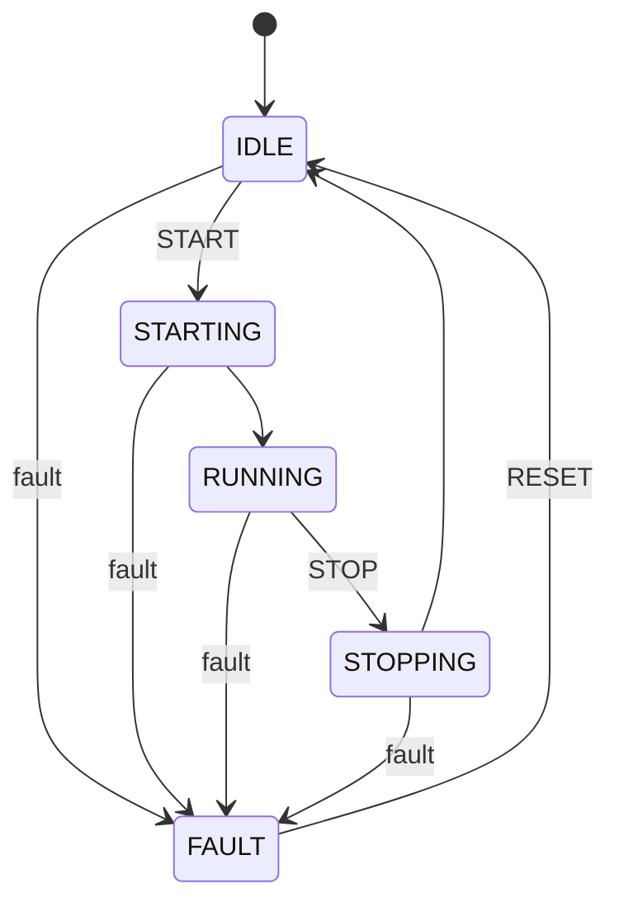

# BHKW System Tests: Robot Framework & Modbus TCP

Automated system tests for a BHKW (Blockheizkraftwerk / Combined Heat and Power) controller,
using Robot Framework, Modbus TCP and a REST API, against a Software-in-the-Loop (SiL) simulator.

## Architecture

Three layers:

1. **Robot Framework test suites** (`tests/*.robot`) - test cases with tags (`smoke`, `regression`, `negative`)
2. **BHKWLibrary** (`tests/keywords/BHKWLibrary.py`) - Python keywords over Modbus TCP
3. **BHKW simulator** (`simulator/`) - controller state machine, Modbus TCP server (port 5020)
   and FastAPI REST interface (port 8080)

## State Machine



## Test Suites

| Suite | Tests | Interface | Description |
|---|---|---|---|
| `test_start_stop.robot` | TC01-TC03 | Modbus | Start/stop sequences and full cycle |
| `test_fault_handling.robot` | TC04-TC06 | Modbus | Fault injection, recovery, START rejected in FAULT |
| `test_power_regulation.robot` | TC07-TC10 | Modbus | Power and temperature ranges, power after stop |
| `test_rest_api.robot` | TC11-TC17 | REST + Modbus | Health, status, start/stop, REST/Modbus consistency, 409 on invalid START |
| `test_kubernetes_deployment.robot` | TC18-TC20 | REST + Modbus | Simulator deployed on Kubernetes (local Minikube, not in CI) |

Result: **17/17 passed** in CI (Kubernetes suite excluded). See [`results/console_all_tests_v2.png`](results/console_all_tests_v2.png).

## Modbus Register Map

| Register | Type | Address | Description |
|---|---|---|---|
| Command | Holding | 0x0001 | 0 = none, 1 = START, 2 = STOP, 3 = RESET |
| Power Setpoint | Holding | 0x0002 | kW × 10 (0 = default 50 kW) |
| Fault Injection | Holding | 0x0003 | Test only: writing a fault code forces FAULT |
| State | Input | 0x0001 | 0 = IDLE, 1 = STARTING, 2 = RUNNING, 3 = STOPPING, 4 = FAULT |
| Power Output | Input | 0x0002 | kW × 10 |
| Temperature | Input | 0x0003 | °C × 10 |
| Fault Code | Input | 0x0004 | 0 = none, 1 = over-temperature, 2 = low oil, 3 = grid fault |
| Runtime | Input | 0x0005 | Simulation steps in RUNNING (see known limitations) |

## Quick Start

```bash
pip install -r requirements.txt

# start the simulator (Modbus TCP on 5020, REST on 8080)
python simulator/bhkw_simulator.py

# in a second terminal: all CI suites
python -m robot --pythonpath tests/keywords --outputdir results \
    tests/test_start_stop.robot tests/test_fault_handling.robot \
    tests/test_power_regulation.robot tests/test_rest_api.robot

# smoke tests only
python -m robot --pythonpath tests/keywords --include smoke --outputdir results tests/
```

## Known Limitations

Found in a review of the project; documented, not fixed yet.

- **Rejected commands stay latched.** A command is cleared from the Command register only when
  it is accepted. A START sent during STOPPING is executed later: the BHKW restarts by itself a
  few seconds after reaching IDLE. In a real plant this is an unexpected start-up (see EN ISO 14118).
  No test covers commands sent in transitional states.
- **Faults are injected, not detected.** The simulator has no protection logic (e.g. over-temperature):
  the fault tests verify the reaction to an injected fault code, not its detection.
- **Tests depend on their order.** Several test cases rely on the state left by the previous one
  (e.g. TC02 needs TC01) and fail when run alone or in random order.
- **Real-time simulation.** One simulation step per second: the CI suites take about 2 minutes.
- **Runtime register** counts simulation steps (seconds), not minutes.
- **No requirements specification:** test cases are not traced to requirements.

## Tech Stack

- Python 3.11 (CI), 3.12 (Docker image)
- Robot Framework 7.0, RequestsLibrary
- pymodbus 3.6
- FastAPI, Uvicorn
- GitHub Actions, Docker, Kubernetes (Minikube)

## Author

Steve Meka